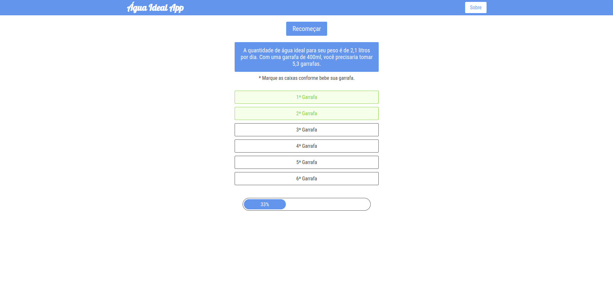

<h1 align="center">Ideal Water Control</h1>

  

Um dos meus primeiros projetos com javascript vanilla. A ideia app é calcular e acompanhar a quantidade de água que devemos tomar por dia, com base nas entradas do usuário.

Com as informações de peso e algum recipiente em ml (como uma garrafa), temos a quantidade mínima de água necessária e o controle dos recipientes que já consumimos, de maneira interativa.

